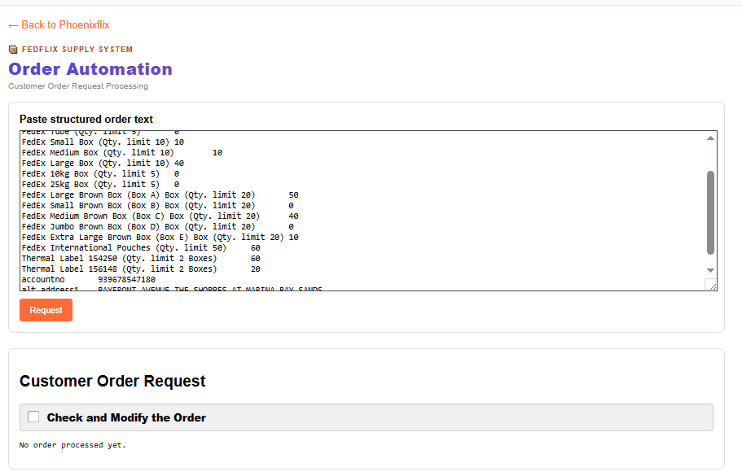
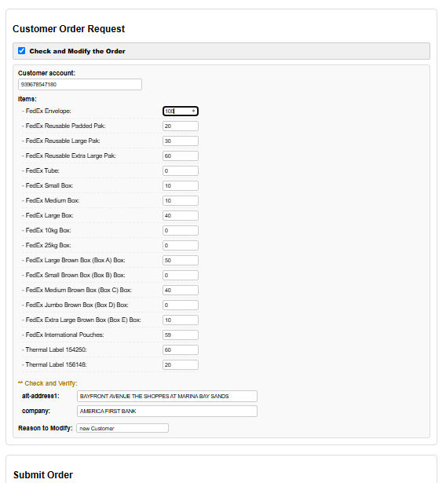
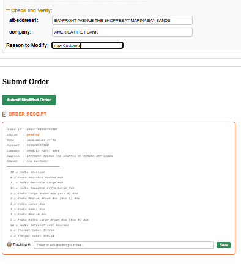
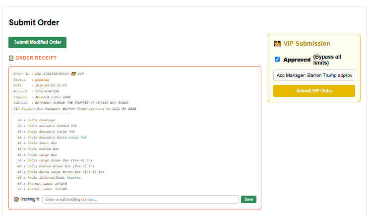
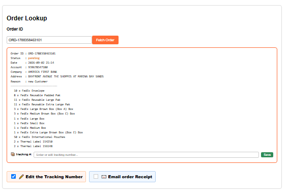
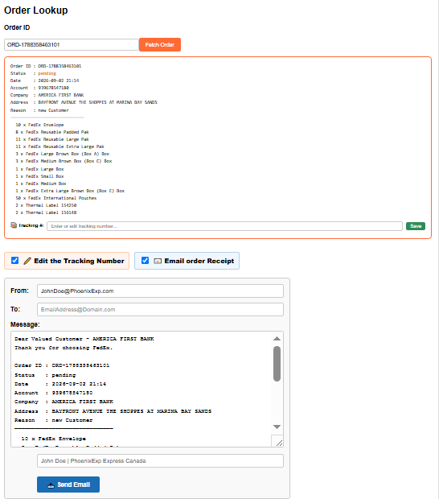
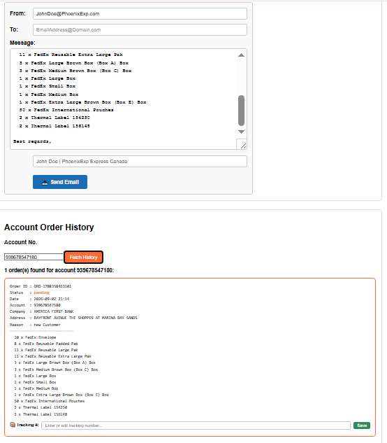

# Order Automation System

A web-based order automation system for PhoenixExp supply management, built as a module inside PhoenixFlix. It handles customer supply order processing with intelligent allocation algorithms and duplicate prevention.

## 🚀 Features

### Core Functionality
- **Intelligent Order Parsing**: Parses structured text input containing customer details and supply items
- **Smart Allocation System**: Applies category limits with proportional distribution (largest remainder method)
- **Duplicate Order Protection**: Prevents multiple pending orders for the same account, items, and address
- **Order History Tracking**: Complete audit trail with order status and approval details
- **VIP & Modified Orders**: Override workflows with required reason logging

### Supply Management
- **Category-Based Limits**:
  - Envelopes: Maximum 10 units total
  - Boxes: Maximum 10 units with proportional allocation
  - Paks: Maximum 30 units total
- **Item-Specific Limits**: Individual caps for special items (thermal labels, international pouches)
- **Brown Box Cleanup**: Automatic normalization of `(Box A/B/C/D/E) Box` suffixes before categorization

### User Interface
- **Clean Web Interface**: Intuitive browser-based application
- **Three Submission Modes**: Regular, Modified (with reason), and VIP (approved full-quantity override)
- **Order History Viewer**: Account-based order retrieval and status tracking
- **Tracking Management**: Add or update tracking numbers; status auto-updates to "Shipped"
- **Email Composer**: Client-side `mailto:` receipt generation

## 📸 Screenshots

The screenshots below follow the main order workflow from request parsing through submission, lookup, email preparation, and account history.

### Main Application Interface


*Main dashboard showing order input, parsing controls, and submission interface.*

### Order Request Form


*Sample order text loaded in the Request form before parsing.*

### Parsed Regular Order


*Parsed customer account and requested items, followed by the regular allocation receipt.*

### Modify an Order


*Check and Modify mode with editable quantities, customer fields, and the required reason.*

### Modified Order Receipt


*Receipt generated after submitting a modified order.*

### VIP Submission


*VIP panel with approval, justification, and the full-quantity receipt.*

### Order Lookup


*Lookup by order ID with optional tracking-number editing.*

### Email Order Receipt


*Email composer populated from the fetched order, including the recipient and plain-text receipt.*

### Account Order History


*Account history showing receipt cards for orders associated with an account.*

## 🔧 Technical Architecture

### Backend (Go)
- **Language**: Go — part of the PhoenixFlix monolith (`handlers/order_handler.go`)
- **Data Management**: In-memory order storage (`[]Order` slice — cleared on server restart)
- **Validation**: JSON decoding, required-field checks, and duplicate detection
- **Allocation Engine**: Proportional distribution (largest remainder method) per category

### Frontend (Vanilla JavaScript)
- **Source**: `public/orders.js` (readable) → `public/min/orders.min.js` (generated)
- **API Integration**: `fetch` with async/await; reads `response.text()` before `JSON.parse` to handle plain-text errors
- **Data Parsing**: Flexible tab/space/digit-suffix text parser
- **State Management**: Module-level `parsedOrder`, `lastOrderId`, `lastAccountNo`

## 📋 API Endpoints

All routes are registered under the `/PhoenixExp/` namespace in `main.go`.

### Order Management
- `POST /PhoenixExp/orders` — Submit new order (regular, modified, or VIP)
- `GET /PhoenixExp/orders/{accountNo}` — Retrieve order history by account
- `GET /PhoenixExp/orders` — Get all orders (admin dump, no auth in demo)
- `GET /PhoenixExp/order/{orderId}` — Get specific order details
- `PUT /PhoenixExp/order/{orderId}/tracking` — Add or update tracking number

### Request/Response Examples

#### Submit Regular Order
```json
POST /PhoenixExp/orders
{
  "items": [
    { "itemName": "PhoenixExp Envelope", "requestedQty": 5, "qtyLimit": 30 }
  ],
  "customer": {
    "accountno": "698583622",
    "company": "Example Company",
    "alt-address1": "123 Main St"
  }
}
```

#### Submit VIP Order
```json
POST /PhoenixExp/orders
{
  "items": [...],
  "customer": { "accountno": "698583622" },
  "isVip": true,
  "vipReason": "Manager approved full quantity"
}
```

#### Submit Modified Order
```json
POST /PhoenixExp/orders
{
  "items": [...],
  "customer": { "accountno": "698583622" },
  "isModified": true,
  "modifyReason": "Customer requested address change"
}
```

#### Order Response
```json
{
  "orderId": "ORD-1710000000000",
  "customer": { "accountno": "123456789", "company": "Example Company" },
  "requestedItems": [
    { "itemName": "PhoenixExp Envelope", "requestedQty": 5, "qtyLimit": 30 }
  ],
  "approvedItems": [
    {
      "itemName": "PhoenixExp Envelope",
      "requestedQty": 5,
      "qtyLimit": 30,
      "itemSpecificLimit": 999999,
      "approvedQty": 5,
      "category": "envelope"
    }
  ],
  "status": "pending",
  "createdAt": "2026-09-01T14:10:06Z",
  "summary": "Order ORD-1710000000000 is on the way with:\n5 x PhoenixExp Envelope",
  "trackingNumber": "",
  "isVip": false,
  "vipReason": "",
  "modifyReason": ""
}
```

The response can also include these workflow fields:

- `trackingNumber`: Empty until tracking is saved; a non-empty value makes the browser display the order as **Shipped**.
- `isVip`: `true` for an approved VIP submission; VIP responses also include `vipReason`.
- `vipReason`: The required justification supplied with a VIP submission.
- `modifyReason`: The required justification supplied with a modified submission.

These fields use `omitempty` in the Go model, so empty optional values may be omitted from the serialized response. `itemSpecificLimit` is included on approved items when the backend applies an item-specific limit.

#### Duplicate Response (409 Conflict)
```json
{
  "error": "Duplicate order – same account, same items & quantities, same address. Change any item, quantity, or address — or use Modify / VIP to override.",
  "duplicateOfId": "ORD-1640995200000",
  "duplicateItems": [...]
}
```

## 🛠 Installation & Setup

This module runs as part of the PhoenixFlix Go server. No separate installation is needed.

```bash
# From the project root
go run .

# Open in browser
# http://localhost:8080/orders
```

## 📖 Usage Guide

### 1. Order Input
Paste structured order text in the textarea (tab-separated or space-separated):
```
PhoenixExp Envelope (Qty. limit 30)	5
PhoenixExp Small Box (Qty. limit 10)	3
accountno	698583622
company	Example Company
alt-address1	123 Main St
```

### 2. Parse Order
Click **Request** to parse and preview. The system extracts customer fields and item rows.

### 3. Submit Order
- **Regular**: Click **Submit Regular Order** — applies category limits and duplicate check
- **Modified**: Enable **Check and Modify**, edit quantities/address, enter a reason, click **Submit Modified Order**
- **VIP**: Use the VIP panel, check **Approved**, enter a reason, click **Submit VIP Order**

### 4. View History
Enter an account number and click **Fetch History** to view all orders for that account.

### 5. Manual Test Checklist
- Paste the sample and click **Request**; confirm the account and every item appear.
- Change the account, submit a regular order, and save the returned order ID.
- Submit the same regular payload again; confirm the duplicate response is readable.
- Enable **Check and Modify**, change a quantity or address, leave the reason empty, and confirm submission is blocked in the browser.
- Enter a reason and submit the modified order; confirm its receipt contains `modifyReason`.
- Try VIP without approval, then without a reason, then with both; confirm only the last attempt is sent.
- Fetch an order with `ORD-...` and with only the numeric suffix; both should work.
- Enable tracking editing, save a tracking number, and confirm every visible copy changes to **Shipped**.
- Fetch account history and confirm multiple receipt cards render.
- Fetch an order containing `emailaddress`; confirm the email recipient and plain-text body are populated.
- Restart the Go server and confirm the in-memory limitation is understood: previous demo orders are gone.
- **Cold starts.** The production API may take a moment to wake up; keep the spinner and disable the active submit button while awaiting the response.

## 🔍 Key Functions

### Allocation Logic (`allocateProportions`)
Uses the **largest remainder method**:
1. Calculate each item's fractional share of the category limit
2. Assign floor values first
3. Distribute remaining units to items with the largest fractional remainders
4. Ties broken by larger requested quantity

### Duplicate Detection (`sameItems`)
A regular order is rejected only when all match an existing `pending` order:
- Same `accountno`
- Same non-zero item name + quantity pairs (order-insensitive)
- Same `alt-address1`

VIP and modified orders skip this check entirely.

### Item Categorization (`categorizeItem`)
Strips `(Box A/B/C/D/E) Box` suffixes before matching against `CATEGORY` map entries. Returns `envelope`, `pak`, `box`, or `other`.

## 🔒 Security & Validation

- **Required Fields**: `items` array and `customer.accountno` are required for all submissions
- **Quantity Bounds**: Clamped to `[0, effectiveLimit]` where `effectiveLimit = min(qtyLimit, itemSpecificLimit)`
- **Duplicate Protection**: Prevents conflicting pending orders for the same account
- **Storage Limitation**: In-memory only — all orders are lost on server restart

## 📊 Order Categories

### Envelopes (Limit: 10 total)
- PhoenixExp Envelope

### Paks (Limit: 30 total)
- PhoenixExp Reusable Padded Pak
- PhoenixExp Reusable Large Pak
- PhoenixExp Reusable Extra Large Pak

### Boxes (Limit: 10 total)
- PhoenixExp Small Box, Medium Box, Large Box
- PhoenixExp 10kg Box, 25kg Box
- PhoenixExp Large/Small/Medium/Jumbo/Extra Large Brown Box

### Special Items (Item-Specific Limits, No Category Cap)
- PhoenixExp International Pouches (Limit: 50)
- Thermal Label 154250 (Limit: 2)
- Thermal Label 156148 (Limit: 2)

## 👤 Author

© 2025 ThePhoenixFlix - Ben Tran
- GitHub: https://github.com/ThePhoenixFlix
- Email: ThePhoenixFlix@gmail.com
- Website: https://bit.ly/ThePhoenixFlix

## 🚀 Deployment

Deployed as part of the PhoenixFlix backend on Render. The frontend static files are served by the same Go server.

```dockerfile
FROM golang:1.25-alpine AS builder
WORKDIR /app
COPY . .
RUN go build -o main .

FROM alpine:latest
RUN apk --no-cache add ca-certificates
WORKDIR /root/
COPY --from=builder /app/main .
CMD ["./main"]
```

## 📄 License

This project is licensed under the BSD 3-Clause License.

---

*Built with Go, vanilla JavaScript, and in-memory storage for reliable supply order automation.*
